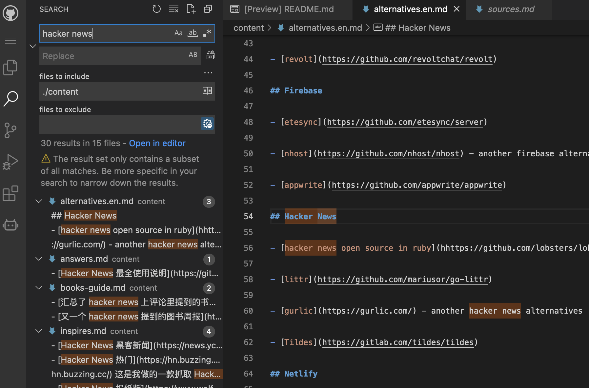

我一直把博客当成自己所有产出集合的地方，所以搜索对我非常重要，之前一直没有加搜索功能是因为目前静态博客的搜索并没有一个特别好的方案，所以我之前搜索自己的博客内容都是通过本地 VSCode 来搜索，但是 VSCode 其实启动挺慢的，而且如果不在电脑边，也没法用，所以最后还是调查了几种搜索办法之后，最后还是选择了自己托管 Rust 开发的[Meilisearch](https://github.com/meilisearch/meilisearch)，但是确实还不是我理想中的方案，只是暂时最不差的方案。

<!-- more -->

对于静态博客的搜索，一种是最常见的客户端 js 搜索，包括 zola 内置的搜索功能也是这样，其原理是 build 的过程中，生成整个网站的搜索的 JSON 索引，然后在前端网页提出搜索请求后，用 js 去搜索这个索引，然后找出对应的结果。这个索引可大可小，如果你只索引标题和路径的话，那么索引就很小，但是如果你索引全文的话，取决于你的文档大小，索引可能会很大。Zola 目前内置的搜索使用 [elasticlunr](https://github.com/weixsong/elasticlunr.js), 其实已经 3 年没有更新了，项目处于等继承者状态。另一个就是，这个基本上算是不支持中文搜索，虽然 Zola 有选项可以建立中文的搜索索引，但是前端库方面对于中文的支持基本上处于不可用状态，我试过了，错误太多了，之前看到一个[日本博主好像确实成功集成了日文搜索](https://www.jpgov.art/posts/japanese-full-text-search-on-zola/), 我仿照的时候也失败了。

为什么对于中文搜索需要专门支持呢？因为所有类似的全文搜索实现都是要先建立一个倒排索引，类似下面这样：

```json
{
  "Hello": ["/hello", "/world"],
  "World": ["/world", "/foo"]
}
```

有了这个索引，就能很快的找到最相关的文章。这种索引对于类似英语的语言来说很好实现，因为英语中分词很简单，只需要根据空格就能把所有词语分开，但是中文没有用空格分开的习惯，所以我们需要很大的词语字典，然后从字典里找到相关的词语，然后再建立分词索引。这才完成第一步（这个比较好解决，因为这一步发生在编译阶段，有足够的资源去做这件事）。第二步是从客户端发出搜索请求，这一步入依然需要分词，比如用户搜索`如何给zola博客添加索引`，搜索引擎首先要把这句话分为`如何`,`给`,`Zola`,`博客`,`添加`,`索引`，然后再去对应的索引里进行最佳匹配查询。所以我觉得对于中文搜索，在客户端做是不现实的，因为基本上没法在客户端上进行复杂的分词，而且虽然文档的增加，全文搜索的索引还会进一步增加，全部加载到客户端在我看来不是一个很道德选择。

## WASM 怎么样？

[WebAssembly](https://webassembly.org/) 以 js 的高性能支持方案进入了主流浏览器的支持，可以用 Rust 或者 C++，或者任何你喜欢的语言来编写 高性能 WebAssembly 应用，然后应用到前端。

对于 WASM，看到过几个有意思的项目，比如[sql.js-httpvfs](https://github.com/phiresky/sql.js-httpvfs), 把 sqlite 数据文件存储到 CDN 服务器上，然后前端用含有内嵌 sqlite 到 wasm 去读取数据，充分利用了 sqlite 的高效，从而可以让 web 客户端完全摆脱服务端数据库的依赖。

我找到了几个关于 WASM 搜索的项目，主要包括：[tinysearch](https://github.com/tinysearch/tinysearch) ,[stork](https://github.com/jameslittle230/stork), [edgesearch](https://github.com/wilsonzlin/edgesearch)

### [Tinysearch](https://github.com/tinysearch/tinysearch)

用 Rust 编写，原理和 js 客户端搜索基本类似，只不过把索引打包到 wasm 里面，最终的 wasm 大小可以是 100k 以内，但是也只支持英文。我把源码下载下来，然后把分词逻辑换用[Meilisearch 的分词](https://github.com/meilisearch/charabia)，尝试打包我目前的博客，发现总共也才 113K，这 113K 同时包括搜索逻辑和索引数据，而用 Zola 自带的搜索打包的纯中文索引数据是 3.5M,英文索引是 650K, 可见作者真的做了很多优化，但是这样对比其实是有一点不公平的，[Zola 的索引会有更好的搜索体验](https://www.getzola.org/documentation/getting-started/overview/), [Tinysearch](https://endler.dev/2019/tinysearch)做了一些取舍，比如不支持前缀搜索，搜索结果只显示标题，没有上下文，也没有高亮等等，但是从性能角度，我觉得这种方案算是客户端搜索的天花板了。

### [Stork](https://github.com/jameslittle230/stork)

同样也是 Rust 编写，只支持英文，颜值很好，接入体验也很棒，搜索结果还能高亮，也有上下文，基本上和[Algolia](https://www.algolia.com/)类似，也是利用了 wasm，不过 Stork 是把逻辑单独打包一个 wasm，把索引数据打包成另一个`st`文件，然后搜索的时候动态的加载索引数据。同样我也尝试把内置的简单英文分词逻辑换用[Meilisearch 的分词](https://github.com/meilisearch/charabia)，但是发现我的索引数据竟然达到了 85M（可能有别的坑，我只是简单的替换了分词的函数），所以就没有更多的体验了。这也印证了，想在客户端把搜索体验做好，确实需要取舍你的索引大小。

### [edgesearch](https://github.com/wilsonzlin/edgesearch)

我喜欢这个哥们的概念，无服务器搜索，把 WASM 部署到 Cloudflare Workers 上，然后客户端通过网络请求进行搜索，我觉得这是最有戏的方案，我喜欢 Cloudflare Workers 这种一次书写永远忘记的无服务器系统，而且每天还有 10 万请求的免费额度，同时作为无服务器冷启动又贼快，我觉得静态博客的最佳搜索方案就是这样了。EdgeSearch 也是先 build 索引，然后把索引上传到 cloudflare 的 KV 里，然后进行搜索，性能很高，只是它也不支持中文，同时目前只是处于实验阶段，接入需要自定义很多东西，希望这个项目可以获得更多的牵引力。

## 难道只能用云搜索服务了吗？

### [Algolia](https://www.algolia.com/)

即刻搜索的鼻祖和天花板，我在[Actionsflow 的文档网站](https://actionsflow.github.io/docs/)中用了他提供给开源项目的免费服务，接入和界面都是一流的，不信你去看[tailwindcss](https://tailwindcss.com/)的搜索体验，太棒了。唯一的问题就是贵，如果不差钱，那我觉得这是最佳选择了。他家同时也是[Hacker News](https://hn.algolia.com/)的御用搜索，我经常用来搜很多东西。感谢感谢！

### [Sourcegraph](https://sourcegraph.com/)

我在[阮老师的科技周刊](https://github.com/ruanyf/weekly)里看到阮老师给用户的其中一个搜索选项是利用 <https://sourcegraph.com/github.com/theowenyoung/blog> 提供的对 Github 源码的免费搜索服务，搜索准确度非常高，但是只能链接到源文件，没法回到网页。这是一个不错的替代品。

<!-- more -->

## VSCode Web 版

你只需要在 github 的网址上加上`1s`之后，就能用浏览器打开你的 github repo，比如我的博客的地址就是：<https://github1s.com/theowenyoung/blog> ，这里自带 vscode 的全局搜索，所以就可以直接在浏览器上搜索博客内容，这其实是一个很好的搜索替代方案，完全不用担心自己托管，搜索速度也超快，就是差一个直接指向搜索并且带搜索参数的链接，我提了一个[Issue](https://github.com/conwnet/github1s/issues/428), 期待一下后续的进度。我期望这个工具能支持类似这样的链接`https://github1s.com/theowenyoung/blog/panel/search?q=term&files-include=content`,这样就可以直接从我的博客里的搜索框跳转到 vscode 的全局搜索里，体验更好。不过这个工具的问题也是首次启动挺慢的，我期待微软官方能出一个类似的工具，反正 github 也是他家的，可能会更快。



## Zola 自带的搜索

https://www.getzola.org/documentation/content/search/
