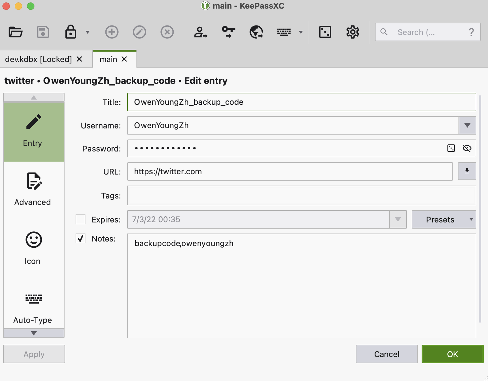
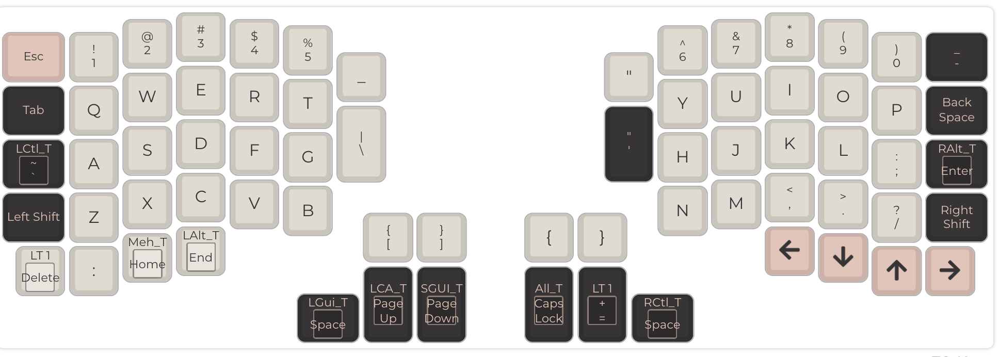

作为技术人员,我对 web3 最大的障碍是创建一个 web3 身份并体面的保存下来。一个 web3 身份实在太重大了，我必须能良好的管理我的 web3 私钥，我我才有信心创建它，不然我怀疑我的整个 web3 世界只会建立在一个岌岌可危的根基上。

<!-- more -->

我之前一直在用人脑管理我的密码，所以我不在任何地方记录我的密码。而由于我没有地方去体面的记录密码，而我的人脑又无法记住一个那么长的私钥，所以我一直对创建一个 web3 身份很害怕。

## 为什么不用密码管理器？

简单的答案是：没有契机。密码管理器一直给我一种很贵很复杂，然后还全是 GUI 界面(通过研究各种密码管理工具，证明这是一个错误的印象)，而我喜欢纯文本工具，我喜欢用简单的工具。所以在此之前我一直使用一套可以用人脑计算的密码模型来决定我的密码，这使得我在每个网站每个账户的密码都不一样，这样我就不需要太担心哪家密码有泄露。这一套基本运行良好，但是我内心一直希望哪天可以有一套更科学的密码管理器来整理我的各种账户，我目前这套靠人脑的密码管理只适合我主动创建的账户，它不适合各种工具生成的 Token, ssh key, 一个 web3 身份，或者是一个双重因素验证的恢复码，这些东西没法靠人脑，一定需要放在某个地方存起来，或者打印出来放在某个地方。

为什么没有契机去做呢？**因为我的数字花园很混乱**。

定义一个人的数字花园混乱不混乱只需要看一点，那就是你在重装你的电脑系统后，能否体面地把自己的系统成恢复原样？（利用全盘备份的方式把系统恢复成和之前一模一样的在我看来并不体面，这种方式的恢复只是治标，隐藏在冰面之下的是一个不可重现的巨大黑盒。所以这种方式只能作为一种方便的备份手段，而不能成为数字花园的根基）。当然如果你连全盘备份都没有的话，那你的数字花园可能算是危房了。

在这个意义上，[NixOS 系统](https://nixos.org/)算是可重现系统的天花板了，它的整个系统的核心设计理念就是可重现，可配置。安装 NixOS 系统，其实就是根据你的配置文件生成出来的，所以，同样的配置，永远都能构建出一模一样的系统，这简直太适合完美主义者了。你可以看下[一个 nixos 全系统的配置文件](https://github.com/gvolpe/nix-config)，这就是整个系统。

## 一个契机的诞生

前段时间，我需要在自己的 macbook pro 上临时装一个 windows 系统（银行，政府，u 盾，驱动相关），本来我也不想动原有的系统，所以我就尽我所能把我总共就 256G 的存储清出来 95 个 G（我正常情况下电脑剩余空间通常都是 20G 以下），然后开始使用苹果的系统助手新建 windows 系统，结果有一个该死的错误`An error occurred while copying the Windows installation files`阻止了它，我开始尝试网上提到的各种办法，30 分钟后，苹果系统还是会告诉我一模一样的错误。

**所以只能祭出最鲁棒的方法了，重装 macOS 系统，然后再安装 windows 系统**

**但是，我敢这么做吗？我会不会有什么重要的东西忘记备份？之后要花多久重新恢复我的系统？**

这让我下定决心，决定花大量的精力去重建我的数字花园根基，力求我的数字花园变得轻量，可重现，可持续化。这和我的博客一样，都属于值得用一生的时间去维护的一个东西。

## Dotfiles

随后我了解到一个东西叫做 [Dotfiles](https://dotfiles.github.io/),简单的来说，这个 dotfiles 就是管理你整个系统的配置文件的集合。

> 为什么叫 Dotfiles，因为类 unix 系统里习惯把配置文件用 dot 开头的文件名命名，如`.gitignore`,就是 git 的忽略配置文件， dot 开头的文件在系统中是默认隐藏的。所以如果有一个文件夹存放你全部的配置文件，那大家习惯上叫这个文件夹为`dotfiles`. 关于如何组织自己的 dotfiles 文件，有非常多的方式，辅助工具，[Dotfiles](https://dotfiles.github.io/) 就是一个很好的指引。

> 如果我没有进入这个新领域，我永远都不会知道光 github 上就有[17 万人](https://github.com/search?q=dotfiles)在公开他们的 dotfiles 文件

**在我看来使用 dotfiles 文件主要有 3 个好处：**

1. 随时随地轻量级的重现你的环境
2. 可以在本地删除某个工具，然后在想恢复的时候，无痛恢复这个工具
3. 现实中有人把自己房子打理的特别好，分类特别科学，当我们在数字世界中做了类似的整理之后，会对整个数字世界的体验变得非常的有信心，也可以帮助你了解很多软件的运行机制。

从[这个页面看](https://dotfiles.github.io/utilities/)，至少有 24 个工具可以帮你管理 dotfiles 文件，[chezmoi](https://chezmoi.io)可能是其中最全面的工具，但是我最终选择了[一个比较小众的 rust 编写的二进制工具 Comtrya](https://github.com/comtrya/comtrya)，因为我想尽可能维持 dotfiles 管理工具的轻量级，不想过度复杂化 dotfiles，这个工具的配置大概长这样(`ssh/ssh.yml`)：

```yaml
actions:
  - action: file.copy
    from: config
    to: "{{user.home_dir}}/.ssh/config"
    template: true
  - action: file.link
    source: id_ed25519.pub
    target: "{{user.home_dir}}/.ssh/id_ed25519.pub"
```

这是我的对 ssh 配置文件的动作配置，用`yaml`语言配置，是[ansible](https://www.ansible.com/)工具的非常轻量级的替代。这几行配置告诉 comtrya 把指定的配置文件复制或者软链接到该去的地方，同时我在复制的过程还使用了模版，因为我在`config`配置文件里对 macos 加了一点小小的东西`UseKeychain yes`：

```bash
Host *
  AddKeysToAgent yes
  IdentityFile ~/.ssh/id_ed25519
  UseKeychain yes
```

这样之后，我的 ssh 配置就可以在 macos 和 linux 系统上通用了。

我最终的全部[dotfiles](https://github.com/theowenyoung/dotfiles)我已经放在 github 上了。整体的结构大概如下：

```bash
├── modules
│   └── zsh
│       ├── change_zsh_as_default_shell_debian.sh
│       ├── files
│       │   ├── alias_debian.zsh
│       │   ├── general_config.zsh
│       │   ├── includes
│       │   │   ├── 1_env.zsh
│       │   │   ├── 2_path.zsh
│       │   │   ├── 3_function.zsh
│       │   │   ├── 4_aliases.zsh
│       │   ├── path_macos.zsh
│       │   ├── zshenv.zsh
│       │   └── zshrc.zsh
│       ├── install_zsh_debian.sh
│       └── zsh.yml
├── private
│   ├── keepassxc
│   │   ├── dev.kdbx
│   │   ├── high.kdbx
│   │   └── main.kdbx
│   ├── ssh
│   │   ├── files
│   │   │   ├── config
│   │   │   └── id_ed25519.pub
│   │   └── ssh.yml
└── scripts
    ├── 0_install_pre_required_modules_for_debian.sh
    ├── 1_configure_macos.sh
    ├── 1_install_required_modules_for_debian.sh
    ├── 2_import_dotfiles_debian.sh
    ├── 2_install_required_modules_macos.sh
    ├── 3_import_dotfiles_macos.sh
    ├── 4_install_modules_macos.sh
    ├── env.sh
    ├── import_ssh_key.sh
    ├── import_temp_env.sh
    ├── link_all.sh
    ├── test.sh
    └── unlink.sh
```

其中`modules`存放所有的模块的配置，我讨厌分类，所以`macos`的相关配置也是其中的一个模块。还有一个`private`文件夹，这里面放我觉得不便公开的模块的配置（但也不包含任何明文密码），比如说 ssh 的 config，caddy 的 config Caddyfile，以及密码管理器 [keepassxc](https://github.com/keepassxreboot/keepassxc)中加密后的文件。我把 private 单独在 github 上设置了一个私有仓库，然后克隆在 dotfiles 仓库里，并在 dotfiles 仓库里忽略这个文件夹。

[keepassxc](https://github.com/keepassxreboot/keepassxc)是我最终选用的密码管理器，开源，易用，且久经考验。同时拥有 GUI 客户端，以及命令行客户端，可以很好的集成在我的 dotfiles 工作流里，同时 GUI 也可以方便的和浏览器等集成以及方便地编辑密码。这是一个完全本地的密码管理器，不依赖任何中心，你所有的密码都存放在一个加密后的文件,GUI 界面大概长这样，这是编辑某个密码的页面：



我总共使用 3 个文件存放我的密码：

```bash
high.kdbx
main.kdbx
dev.kdbx
```

其中`high.kdbx`是我的最高级的密码，比如银行密码，支付密码等，`main.kdbx`是我其他主要密码，比如 twitter，github 等，Like this:

```bash
twitter/
github/
hacker_news/
Microsoft/
GPG/
servers/
tools/
amazon/
ifttt/
IRC/
```

而`dev.kdbx`是我在各种开发服务器中会用到的密码，包括 token, 环境变量，ssh key 等,like this:

```bash
youdao_translate_secret
ssh/
github/
cloudflare/
ifttt/
telegram/
envs/
```

这三个密码文件都有不同的主密码，这三个主密码可以说是我人生最重要的秘密了，理论上这 3 个密码是我需要记住的全部密码了。

有了这个密码管理器，我的 dotfiles 文件的最重要的根基就搭建好了，我主要在 dotfiles 文件里使用 shell 脚本来管理所有的软件安装（顺便学习了一直想学习的`bash`脚本语言），每个 module(比如窗口管理器[tmux](https://github.com/tmux/tmux)) 下面都有一个类似`install_tmux_macos.sh`的脚本。然后还有一个`tmux.yml`的文件去告诉[Comtrya](https://github.com/comtrya/comtrya)去执行复制文件到对应 module 的配置文件夹所在地。`scripts`文件夹放一些集合的脚本，比如一次性安装所有的必要软件的脚本，这里面的脚本一般来说是调用 modules 里已有的脚本。

**所以，当我现在有个新电脑，我的初始化流程将会是这样：**

1. 安装 xcode 的开发者工具（这样才能用 git 等命令）

```bash
xcode-select --install
```

1. 克隆 dotfiles 文件夹

```bash
git clone https://github.com/theowenyoung/dotfiles.git ~/dotfiles
cd dotfiles
git clone https://theowenyoung:<token>@github.com/theowenyoung/private.git ~/dotfiles/private
```

2. 运行配置 macos 的文件，这样就不用一个个在界面上去做配置了，全部配置见[这里](https://github.com/theowenyoung/dotfiles/blob/main/modules/macos/configure_macos.sh)

```bash
./scripts/1_configure_macos.sh
```

3. [安装必备软件](https://github.com/theowenyoung/dotfiles/blob/main/scripts/2_install_required_modules_macos.sh)

```bash
./scripts/2_install_required_modules_macos.sh
```

4. 安装[配置文件](https://github.com/theowenyoung/dotfiles/blob/main/scripts/3_import_dotfiles_macos.sh)（这一步会导入所有配置文件，以及密码，需要的环境变量等等（命令行脚本会提示你输入密码））

```bash
./scripts/3_import_dotfiles_macos.sh
source ~/.zshrc
```

> 其中包含 1 个[导入 ssh key 的脚本](https://github.com/theowenyoung/dotfiles/blob/main/scripts/import_ssh_key.sh)，和[导入临时环境变量的脚本](https://github.com/theowenyoung/dotfiles/blob/main/scripts/import_temp_env.sh)

5. 独立安装其他想安装的软件

```bash
./modules/foo/install_foo_macos.sh
```

Linux 的初始化也是类似，可以看我的 [readme 文件](https://github.com/theowenyoung/dotfiles#deiban-init), **我强烈建议你不要直接用我的 dotfiles 文件**，就像自己的房子一样，你应该始终自己从头开始构建，这样才是保持可持续的好方法（我对[anki](https://www.ankiapp.com/)的使用也是同样的观点，你应该使用自己插入每一个要记住的单词，而不是使用别人做好的列表，只有你自己插入的，你才有场景去记住它）。我的 repo 只是给你做参考，还有[17 万人](https://github.com/search?q=dotfiles)的 dotfiles 可以用来参考。

[Comtrya](https://github.com/comtrya/comtrya)的运行操作的命令是：

```bash
comtrya apply
```

这个命令会应用所有当前目录下他找到的`.yml`文件。我写了一个[更方便的 bash 命令](https://github.com/theowenyoung/dotfiles/blob/main/modules/comtrya/files/comtrya_alias.zsh)去做这件事,有了个 function 之后，我可以在任意目录执行这些命令：

表示仅应用 ssh 模块下的配置：

```bash
ca ssh
```

表示应用全部模块的全部更新：

```bash
ca all
```

如果你当前在某个模块目录下，直接运行：

```bash
ca
```

即可执行当前模块的配置。

另外我还有一个[`unlink.sh`](https://github.com/theowenyoung/dotfiles/blob/main/scripts/unlink.sh) 的脚本，可让你一件删除所有 comtrya 创建的配置文件（为了更清晰，这个脚本是手动维护的）

### 关于我的键盘

我用的键盘的[键位配置](https://github.com/theowenyoung/dotfiles/tree/main/modules/qmk)也在里面，我使用一款叫 [redox](https://github.com/mattdibi/redox-keyboard) 的分体键盘（顺便说一下，分体键盘真的好用，你可以把手按照最舒服的姿势摆在任何地方），我的键盘的键位大概长这样：



这是一个[客制化](https://www.zfrontier.com/app/flow/2wXVPWNnXn5v)的键盘，意味着我可以按照我的习惯自定义全部的按键，还有一个重要功能是，可以“一键两用”，比如我最常用的空格键，在单击的时候是空格键，但是在按住的情况下是`cmd`键，几乎每个控制键, 我都重新定义了他在单击的时候的键位，这样就最大化的利用了键盘里最常用的区域。还有一个是键盘支持多层，我只利用了 2 层，我觉得人脑记不住那么多层，我的第二层就放一些播放，暂停，下一首，静音之类的控制键和 F1 到 F12 的键位。

你可以在[这里](https://config.qmk.fm/#/redox/rev1/LAYOUT) 导入我的[键位配置文件](https://github.com/theowenyoung/dotfiles/raw/main/modules/qmk/files/redoxpro/redoxpro.json)，以查看我的键盘的更多层。

## 结论

在做完以上的一切后，我的数字生活开始变得更加的得心应手，系统也更加的 robust，基本上可以随时 reset 重来。以及我终于拥有了自己的第一个以后会稳定使用的 web3 身份了（以前注册的 metamask 真的找不到了，不过反正也没钱），也许我应该把之前在 [matters](https://matters.news/) 上赚的一点点 like 币（被我在交易所换成了 200 usdt 了）转到这里？以及我还需要开哪些 web3 账户？

> 上次看了这个[nostr](https://branle.netlify.app/)协议，觉得很喜欢，现在终于可以生成一个永久账户了：[astral](https://astral.ninja/57c22f1ceef806230690b0932e3bc850d485f34ee722378b0f6f2e403097caa1)

以及这是我当前的[全部模块](https://github.com/theowenyoung/dotfiles/tree/main/modules),里面有我精心调试的最优配置（对于我），以及由于刚开始维护，还在频繁不断完善中（但是我对当前的文件结构很满意）：

```bash
├── modules
│   ├── acme
│   ├── alacritty
│   ├── alfred
│   ├── anki
│   ├── automator
│   ├── bash-language-server
│   ├── bat
│   ├── broot
│   ├── caddy
│   ├── cargo-generate
│   ├── clash
│   ├── comtrya
│   ├── curl
│   ├── dashflare
│   ├── dufs
│   ├── editor
│   ├── fd
│   ├── font
│   ├── fzf
│   ├── git
│   ├── git-filter-repo
│   ├── gnupg2
│   ├── gost
│   ├── helix
│   ├── homebrew
│   ├── hurl
│   ├── jq
│   ├── kakoune
│   ├── keepassxc
│   ├── kitty
│   ├── lua_language_server
│   ├── macos
│   ├── macports
│   ├── meilisearch
│   ├── microsoft_edge
│   ├── miller
│   ├── napa
│   ├── navi
│   ├── nodejs
│   ├── nvim
│   ├── pass
│   ├── passwd
│   ├── pepper
│   ├── pip3
│   ├── podman
│   ├── podman-compose
│   ├── postman
│   ├── qBittorrent
│   ├── qmk
│   ├── rage
│   ├── rust
│   ├── rust-analyzer
│   ├── shadowsocks-rust
│   ├── simple-torrent
│   ├── ssh
│   ├── ssh-agent
│   ├── starship
│   ├── systemd
│   ├── taplo
│   ├── tiny
│   ├── tmux
│   ├── translate-shell
│   ├── vscode
│   ├── wasm-pack
│   ├── wezterm
│   ├── wrangler
│   ├── yaml-language-server
│   ├── zellij
│   └── zsh
```

我用[tmux](https://github.com/tmux/tmux) 管理窗口，终端用[Alacritty](https://github.com/alacritty/alacritty) ,模态编辑器
[helix](https://github.com/helix-editor/helix) 和[kakoune](https://github.com/mawww/kakoune),kak 更成熟，但是更喜欢 helix，我买了[alfred](https://www.alfredapp.com/)的终身版，现在它已经升级到 alfred5 了（但是 alfred 的配置文件太恶心了，不适合在 dotfiles 里管理，因为是自动生成的，由于这一点我想找一个替代品，但是没有体验更好的），我用[navi](https://github.com/denisidoro/navi) 管理常见的 [cheatsheets](https://github.com/theowenyoung/dotfiles/tree/main/modules/navi/files/cheats), [fzf](https://github.com/junegunn/fzf)查找文件（太好用了，强烈推荐），以及很多其他的好东西，上述的一些 module 有的已经没有在用了，但是配置文件我想留着，以防将来有一天想再试试。

在[这里查看整个 dotfiles repo](https://github.com/theowenyoung/dotfiles/)

> 最后还要建议 web3 的大佬们，你们应该投资密码管理器才对，把更好用的密码管理器免费带给大家！
