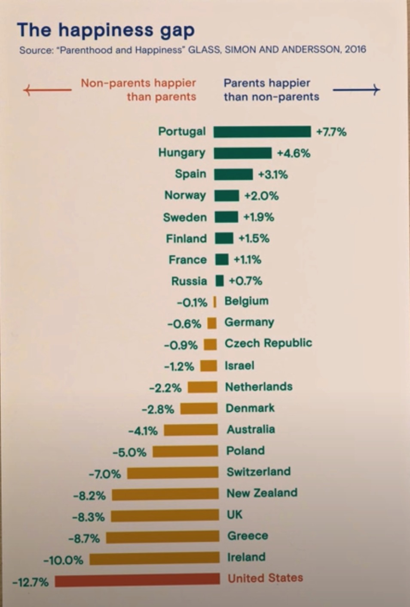

收集丁克相关的文章和帖子。

<!-- more -->

## 网站

- [Stop having kids](https://www.stophavingkids.org/) - 停止生孩子

## 讨论

- [我不想要孩子 - reddit 讨论](https://www.reddit.com/r/CasualConversation/comments/umgu59/i_dont_want_kids/)
  - 我宁愿后悔没有孩子，也不愿后悔有孩子。人生选择总是伴随着一些遗憾，这是选择的结果，你应该可以选择与哪个遗憾一起生活。
  - DINK LIFE! (Double income no kids)
  - DILDO life is great too! (Dual income large dog owners)

## Articles

- [关于要不要生孩子的讨论](https://www.newyorker.com/magazine/2012/04/09/the-case-against-kids#ixzz2Lko98hTE)
  - > 任何人的生物成分是否如此有价值，以至于它必须永久化?
  - > 另一些人说："公民对社会有责任为社会的延续提供保障义务”，总结来说就是："将妇女变成生育机器"
  - > 很多人提出这样一种观念，即为人父母会让他们快乐。可悲的是，这里的证据对他们不利。研究表明，有孩子的人并不比没有孩子的人更满意自己的生活。换一句话说：父母并不那么快乐。在 2004 年发表在《科学》杂志上的一项著名的研究中，诺贝尔奖获得者心理学家丹尼尔·卡尼曼（Daniel Kahneman）要求九百名职业女性评估她们前一天的经历。这些女性认为，她们花在照顾孩子上的时间不如花在购物、吃饭、锻炼、看电视、准备食物和打电话上的时间那么愉快。这些妇女发现比照顾孩子更不愉快的少数活动之一是做家务，也就是说，在她们之后打扫卫生。
  - > "为了使自己受益而生孩子是一种道德错误"
  - > 如果我們都看到生孩子所造成的傷害，並阻止它，在一個世紀左右的時間內，世界人口將下降到零。对于贝纳塔尔来说，这是一个虔诚地希望的结果。"人类不幸地成为地球上最具破坏性和最有害的物种，"他写道。"如果我们不再有更多人，世界上的痛苦程度可以大大减少"。
  - > 从未出生是最好的，但是一旦你进入了这个世界，尽快返回您来自的地方。
  - > "生活是如此可怕，最好不要出生。谁这么幸运？ -- 古犹太谚语
- [不出生的理由](https://www.newyorker.com/culture/persons-of-interest/the-case-for-not-being-born)
  - 节选：
    - 生活是如此糟糕，如此痛苦，以至于人类应该出于同情心的原因停止生孩子
    - "虽然好人竭尽全力使他们的孩子免于痛苦，但他们中似乎很少有人注意到，防止他们孩子所有痛苦的一个（也是唯一）有保证的方法就是首先不要让这些孩子存在"
    - 繁殖本质上是残酷和不负责任的——不仅仅是因为可怕的命运可能降临到任何人身上，还因为生活本身"充满了坏处"。部分由于这个原因，他认为如果有知觉的生命完全消失，世界会变得更好。
    - 他们对孩子寄予厚望，而这些希望往往在孩子以某种方式令人失望时受到挫折。当我们亲近的人受苦时，我们会很悲伤。当他们死去时，我们便失去了他们。
    - "如果生活如此糟糕，你为什么不自杀呢？" “生活是糟糕的，但死亡也是糟糕的”
    - 梅辛格支持数字反生育主义，认为创建有意识的计算机程序是错误的，因为这样做会增加世界上的痛苦程度。同样的论点也适用于人类。
    - 痛苦比快乐更糟糕。疼痛持续的时间更长："有慢性疼痛这样的东西，但没有慢性快乐这样的东西，"
    - 你會用五分鐘的可想像到的最嚴重的痛苦來換取五分鐘最大的快樂嗎？
    - 错过好的经历并不像拥有糟糕的经历那么糟糕。
    - “对于一个现有的人来说，坏事的存在是坏事，好事的存在是好事，"贝纳塔尔解释说。"但与此相比，如果那个人从未存在过，那么，没有坏人会是好事，但坏事的缺席不会是坏事，因为没有人会被剥夺这些好事。
    - 所以，不生育的话，所有的不愉快、所有的痛苦和所有的痛苦都可以结束，而没有任何真正的代价。
    - 有些人认为，谈论痛苦和快乐没有抓住重点：即使生活不好，它也是有意义的。贝纳塔尔回答说，事实上，人类生命在宇宙中是没有意义的：我们存在于一个冷漠的宇宙中，甚至可能是一个"多元宇宙"，并且受到盲目和无目的的自然力量的影响。在缺乏宇宙意义的情况下，只剩下"地球"意义——而且，他写道，"关于认为人类存在的目的是人类个体应该互相帮助，这是一种循环。贝纳塔尔还驳斥了这样一种观点，即斗争和痛苦本身可以为存在赋予意义。"我不相信痛苦会赋予意义，"贝纳塔尔说。"我认为人们试图在痛苦中找到意义，因为痛苦是如此无端和难以忍受。他说，"纳尔逊·曼德拉通过他对痛苦的反应产生了意义，但这并不是为了捍卫他所生活的条件。
    - 我问贝纳塔尔，为什么对他的论点的正确回应不是努力让世界变得更美好。他告诉我，未来可能创造一个更美好的世界，很难为现在人们的痛苦辩护。相反，它只能成为人们遭受苦难的理由。无论如何，一个急剧改善的世界是不可能的。"这永远不会发生。这些教训似乎从未被吸取。他们似乎从未被学习过。也许奇怪的人会学习它们，但你仍然会看到你周围的这种疯狂，"
    - 我们被要求接受不可接受的事情。人们和其他生物必须经历他们所经历的事情，这是不可接受的，他们对此几乎无能为力。
    - "整个世界的疯狂——你或我能做些什么呢？"我们边走边说。"但每对夫妇，或者每个人，都可以决定不生孩子。这是一个巨大的痛苦，避免了，这都是好事。“
    - 生孩子是"相当可怕的，因为它会发现自己处于困境";另一方面，"乐观使生活更容易忍受。“
  - 反对意见：
    - 这是消极的功利主义

## Data

